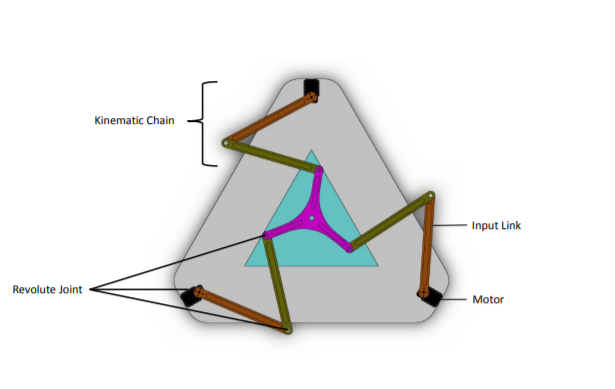
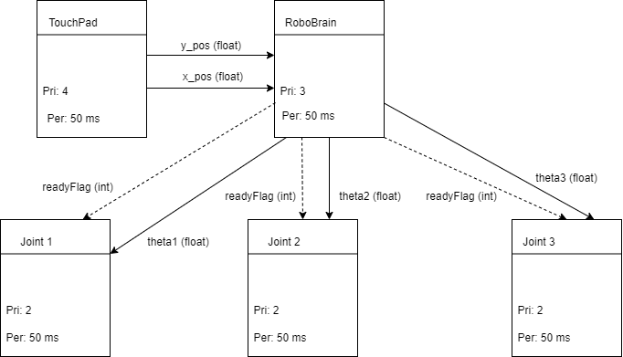
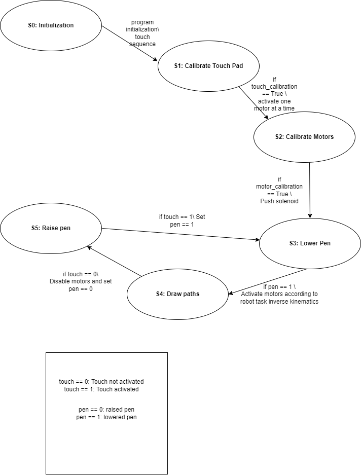

# ME 405 Winter 2022 Term Project: 3.5 Axis Machine
Created by Jonathan Cederquist, Tim Jain, and Philip Pang

## Introduction: Spider-Yoda, the 3-RRR Planar Parallel Robot
For this project our group designed, built, and tested a 3-RRR planar
parallel robot which we have nicknamed "Spider Yoda". This robot is
designed for us as a pen plotter for the average Joe who is interested
in a using a robotic companion to draw anything their heart desires.
Currently, it has only been used by the creators, but it could serve as
a device used to introduce high school or college students to robotics
and promote further interest and research in the field of robotics.

The overall functionality of the robot is quite simple. The moving
platform (which holds a Sharpie or other writing utensil) traces the
user's movements on the attached touchpad to produce a scaled drawing
of whatever path the user traces out. When the user places their finger
or stylus on the touchpad, the robot places the pen on the paper and
begins drawing whatever shape the user does. When the user lifts their
finger, the robot stops motion and the pen is retracted. In the future,
additional functionality may be added to allow the robot to draw on its
own from an uploaded image file. A schematic of a generic 3 RRR planar
parallel robot is shown below.

*Figure 1: Schematic for a generic 3-RRR Planar Parallel Robot. [1]*

## Hardware Overview

### Bill of Materials
The following table shows the bill of materials used for our project. 
Minor components such as solder and wires are not included. It should
be noted that this table only lists the list price of each component,
tax and/or shippping are not included. This can be a significant
component of the project cost depending on the timeline and location
the products are sourced from.

| Qty. | Part                                | Source                | Total Cost |
|:----:|:------------------------------------|:----------------------|:---------: |
|  1   | Nucleo L476RG with Shoe             | ME405 Tub             |      -     |
|  6   | Aluminum Link                       | ME405 Scrap Bin       |      -     |
|  1   | Aluminum Drawing Platform           | ME405 Scrap Bin       |      -     |
|  1   | 3D Printed Pen Holder               | Friend's 3D printer   |      -     |
|  1   | Black Fine Sharpie                  | Tim's Pencil Pouch    |      -     |
|  ?   | Other bolts/nuts                    | ME405 Hardware Stock  |      -     |
|  6   | M3-0.5 x 20mm SHCS                  | Home Depot            |    $1.98   |
|  1   | 2'x 2' Particle Board Base Plate    | Home Depot            |    $4.23   |
|  15  | 1/4" Zinc Flat Washer               | Home Depot            |    $2.40   |
|  10  | 1/4-20 Zinc Hex Nut                 | Home Depot            |    $1.28   |
|  3   | Include 6mm Shaft Collars?          | McMaster Carr         |    $5.31   |
|  6   | 5/16" Needle-Roller Thrust Bearing  | McMaster Carr         |   $19.14   |
|  6   | 5/16" Shoulder Screw                | McMaster Carr         |    $8.52   |
|  3   | 12V Motor w/Encoder, 131 Gear Ratio | DFRobot               |   $87.00   |
|  1   | 12 VDC Open Frame Pull Solenoid     | Chaocheng Technology  |    $?      |
|  3   | Limit Switch                        | Amazon                |    $?      |
|  3?  | Ball transfers                      | Amazon                |    $?      |

### Electronic Components
This project was built around the STM32 Nucleo L476RG microcontroller,
which was also equipped with the "Shoe of Brian" mounting board which
houses a USB on-the-go connector for easier file management. We also
used a DRI0039 quad motor driver shield from DFRobot, which implements
two TB6612FNG motor driver ICs, on top of the Nucleo to drive the three
gear motors and solenoid which lifted the pen. The motors used to drive
the motion of the links were FIT0185 DFRobot gear motors with encoders,
which have a 131:1 gear ratio and 2096 encoder counts per revolution on
the output shaft. The only other major electronic components were the
three roller limit switches, which were used in the calibration of the
robot before drawing began.

### Mechanical Components
Most of the structural mechanical components were found from the ME 405
scrap bin or purchased from Home Depot. The motors served as the stand
for the base platform, which was a 5/8"x2'x2' sheet of particle board
with holes drilled out for the motor shafts. The links and drawing
platform were aluminum scrap with holes reamed in them for close
fitting to the shoulder bolts. Each revolute joint connection included
two washers, a needle-roller thrust bearing to reduce friction, and a
shoulder bolt with a hex nut. The drawing platform itself had the 3D
printed pen holder and solenoid attached, along with ball transfers on
the bottom to support the platform and reduce friction as the robot
moved along the base plate. The rest of the components included wires,
attachement materials (hot glue, tape), and 3D printed limit switch
mounts which allowed the a-links to hold the limit switches for
calibration.

## Software Overview
This section summarizes the software organization for this project with
a task diagram and state transition diagram. The detailed documentation
is found on the doxygen mainpage, linked below:
https://pangling4.github.io/TermProject/

### Task Diagram
This section briefly explains the task organization for the cooperative
multitasking used in this project. The five tasks that were run by the
priority scheduler are shown below in the task diagram. Each joint task
consists of a RoboMotorDriver, a RoboEncoderDriver, and a ClosedLoop 
controller. The joint tasks receive the desired angle from the brain
and perform closed loop PI control using the motor and encoder to move
the link to the desired position. The angles are computed in the brain
from the inverse kinematic equations and the x and y coordinate which
are read from the touchpad.The readyFlag allows the motors and solenoid
to be shut off when the robot is ready to be shut down.

*Figure 2: Task Diagram for 3-RRR Planar Parallel Robot.*

### State Transition Diagram
Information about FSM here - need to update to reflect actual operation

3R_FSM_Touch.drawio.png

*Figure 3: State Transition Diagram for 3-RRR Planar Parallel Robot.*

## Results
Overall, due to the limited timeline for the project, the system has
not been extensively tested. During the development of the controller
for the system, the motors underwent step response tests to determine
appropriate proportional and integral gains. However, these tests were
performed without any load on the motor shaft, as attaching the links
during a step response could damage the robot.

After final assembly, the robot was tested by having users draw on the
touchpad and observing the behavior. The robot's intended functionality
was evident in these tests, although it did not perform to our
satisfaction. One of the major problems we found was that the nature of
a parallel robot having interconnected and interdepedent links often
caused the robot to 'lock up' in a degenerate position where it could 
not move any of its links. When this happened, we had to restart the
robot and manually move the links back to a position where they could
move freely.

Other issues we became aware of during testing were the backlash in the
a-links and the method of control for the inverse kinematics. Both of 
these issues contributed to 'sloppy' behavior for the drawing platform,
since a motion on the touchpad would either not be large enough to 
cause a motion on the platform (due to small angle changes and large 
backlash), or the motion would be overwritten by the next motion since
the links were not able to respond fast enough. Thus, the actual motion
of the drawing platform did not match the motion of the user's hand on
the touchpad.

## Project Learning Outcomes
Overall, this project was more difficult and time-consuming than we
expected, mainly because of the mechanical complexities in our design
and difficulties we encountered during manufacturing and assembly. The
following sections describe some of the major difficulties we faced and
future recommendations for others who build a similar robot.

### Difficulties Encountered
One major problem we encountered while assembling our robot was getting
the a-links to attach securely to the motor shafts. Our original design 
used steel shaft collars with set screws that would be epoxied to the
a-links and then securely tightened onto the d-flat of the motor shaft.
However, the shaft collars would consistently fall off of the a-links
during testing and loading, likely because the surfaces were not well
prepared for epoxy and possibly because the metals being bonded were
not the same (steel vs aluminum). In the final robot, we used d-shaped
holes waterjet into the links directly, but due to the small difference
in diameter between the motor shaft OD and d flat, these ended up
having large amounts of backlash.

Another issue we encountered was in calibration. After creating the 3D
printed mounts for the limit switches and ramps used to locate a known
location for each link, we realized that having the mounts on the links
interfered with the robot motion in some configurations. This could 
have been mitigated by shifting the limit switches closer to the motors
on the link; however, the ramp had already been glued down on the base.
One solution to this problem would be to make longer ramps to allow the
limit switch to slide along the link to any necessary location. An even
better solution would be to embedd the limit switches in the base and
mount the ramps to the bottom of the link, thus reducing the wiring
complexity and allowing the links to move freely without interference.
However, due to the time constraint on the project, we were not able to
implement these improvements.

### Future Recommendations
Overall, the most important recommendation we can offer anyone desiring
to build a similar project is to spend adequate time on the mechanical
design. Creating detailed models, testing the connection methods and
layout, and iterating on failed designs are all important steps in the
design process that should not be skipped. Even the best-written
software is useless if the motor shaft is not securely attached to the
robot link.

Part of the challenge on this project for our team was the limited time
given to complete it. Do not underestimate the time necessary for 
manufacturing your robot. In addition, it is very helpful to buy or
make spare parts for your robot, since you never know when a screw head
will strip, or glue will come loose, or other issue will occur that requires a
replacement. Software can be updated and improved (relatively) easily,
requiring only time to debug and test. On the other hand, updating or
improving mechanical hardware can be significantly more challenging,
especially if tools or materials are not readily available.

## CAD
The mechanical design for this project was performed in SolidWorks. All
of the models created for the project can be found under the src folder
in the CAD Rev4 folder, which has been updated to reflect the actual
dimensions and layout of the robot as-built. The wiring and attachment
components (such as tape and hot glue) are not shown.

Link: https://github.com/pangling4/TermProject/tree/main/src/CAD%20Rev4

[1] G. Johnston, R. Yasin, L. Wang, N. Sarli, and N. Simaan, “Parallel 
3RRR Robot Classroom Guide,” 07-Jul-2016. [Online]. Available: 
http://nri-csa.vuse.vanderbilt.edu/joomla/images/Harpeth_Hall_Winterim/Parallel_3RRR_Robot_Classroom_Guide.pdf. [Accessed: 25-Feb-2022]. 