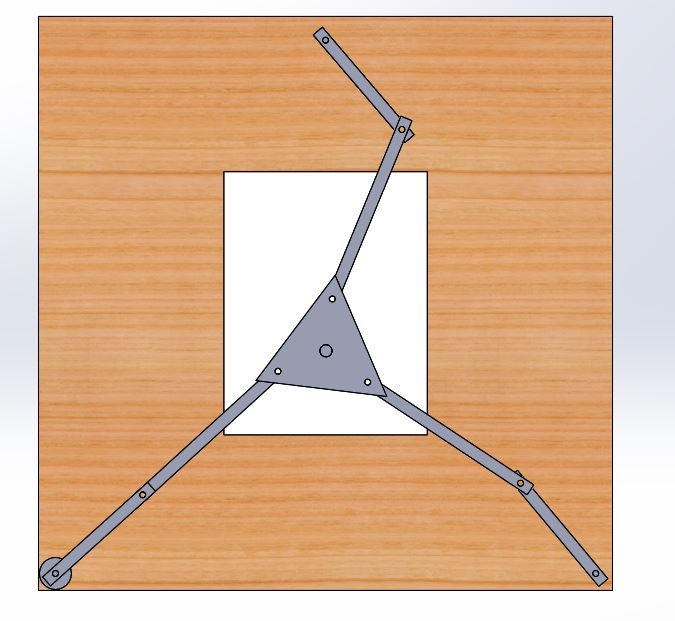
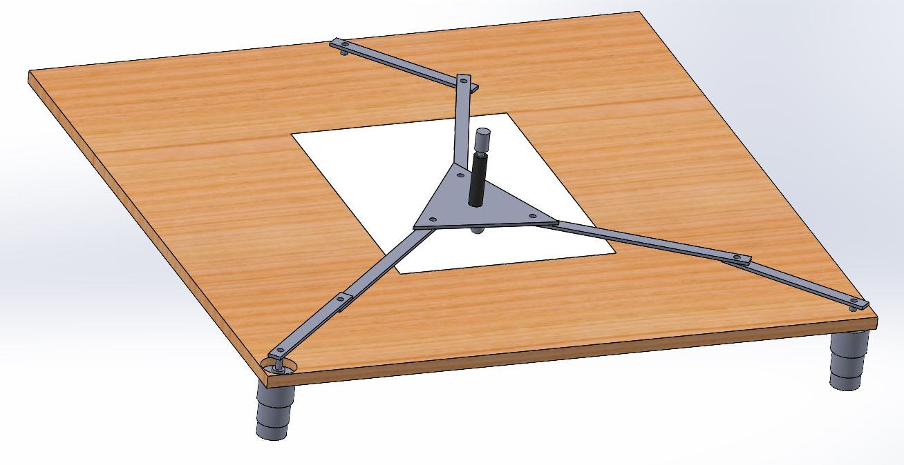
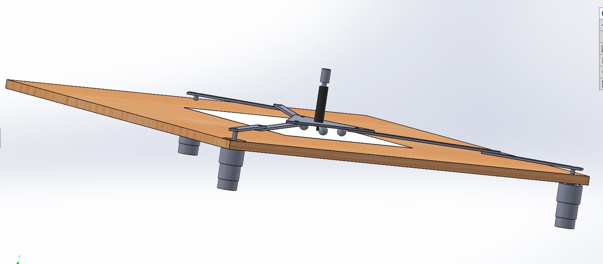

# ME 405 Winter 2022 Term Project: 3.5 Axis Machine
Created by Jonathan Cederquist, Tim Jain, and Philip Pang

## Introduction: Spider-Yoda, the 3-RRR Planar Parallel Robot
For this project our group designed, built, and tested a 3-RRR planar
parallel robot which we have nicknamed "Spider Yoda". This robot is
designed for us as a pen plotter for the average Joe who is interested
in a using a robotic companion to draw anything their heart desires.
Currently, it has only been used by the creators, but it could serve as
a device used to introduce high school or college students to robotics
and promote further interest and research in the field of robotics.

The overall functionality of the robot is quite simple. The moving
platform (which holds a Sharpie or other writing utensil) traces the
user's movements on the attached touchpad to produce a scaled drawing
of whatever path the user traces out. When the user places their finger
or stylus on the touchpad, the robot places the pen on the paper and
begins drawing whatever shape the user does. When the user lifts their
finger, the robot stops motion and the pen is retracted. In the future,
additional functionality may be added to allow the robot to draw on its
own from an uploaded image file. A schematic of a generic 3 RRR planar
parallel robot is shown below.

*Figure 1: Schematic for a generic 3-RRR Planar Parallel Robot. [1]*

## Hardware Overview

### Bill of Materials
The following table shows the bill of materials used for our project. 
Minor components such as solder and wires are not included. It should
be noted that this table only lists the list price of each component,
tax and/or shippping are not included. This can be a significant
component of the project cost depending on the timeline and location
the products are sourced from.

| Qty. | Part                                | Source                | Total Cost |
|:----:|:------------------------------------|:----------------------|:---------: |
|  1   | Nucleo L476RG with Shoe             | ME405 Tub             |      -     |
|  6   | Aluminum Link                       | ME405 Scrap Bin       |      -     |
|  1   | Aluminum Drawing Platform           | ME405 Scrap Bin       |      -     |
|  1   | 3D Printed Pen Holder               | Friend's 3D printer   |      -     |
|  1   | Black Fine Sharpie                  | Tim's Pencil Pouch    |      -     |
|  ?   | Other bolts/nuts                    | ME405 Hardware Stock  |      -     |
|  6   | M3-0.5 x 20mm SHCS                  | Home Depot            |    $1.98   |
|  1   | 2'x 2' Particle Board Base Plate    | Home Depot            |    $4.23   |
|  15  | 1/4" Zinc Flat Washer               | Home Depot            |    $2.40   |
|  10  | 1/4-20 Zinc Hex Nut                 | Home Depot            |    $1.28   |
|  3   | Include 6mm Shaft Collars?          | McMaster Carr         |    $5.31   |
|  6   | 5/16" Needle-Roller Thrust Bearing  | McMaster Carr         |   $19.14   |
|  6   | 5/16" Shoulder Screw                | McMaster Carr         |    $8.52   |
|  3   | 12V Motor w/Encoder, 131 Gear Ratio | DFRobot               |   $87.00   |
|  1   | 12 VDC Open Frame Pull Solenoid     | Chaocheng Technology  |    $?      |
|  3   | Limit Switch                        | Amazon                |    $?      |
|  3?  | Ball transfers                      | Amazon                |    $?      |

### Electronic Components
This project was built around the STM32 Nucleo L476RG microcontroller,
which was also equipped with the "Shoe of Brian" mounting board which
houses a USB on-the-go connector for easier file management. We also
used a DRI0039 quad motor driver shield from DFRobot, which implements
two TB6612FNG motor driver ICs, on top of the Nucleo to drive the three
gear motors and solenoid which lifted the pen. The motors used to drive
the motion of the links were FIT0185 DFRobot gear motors with encoders,
which have a 131:1 gear ratio and 2096 encoder counts per revolution on
the output shaft. The only other major electronic components were the
three roller limit switches, which were used in the calibration of the
robot before drawing began.

### Mechanical Components
Most of the structural mechanical components were found from the ME 405
scrap bin or purchased from Home Depot. The motors served as the stand
for the base platform, which was a 5/8"x2'x2' sheet of particle board
with holes drilled out for the motor shafts. The links and drawing
platform were aluminum scrap with holes reamed in them for close
fitting to the shoulder bolts. Each revolute joint connection included
two washers, a needle-roller thrust bearing to reduce friction, and a
shoulder bolt with a hex nut. The drawing platform itself had the 3D
printed pen holder and solenoid attached, along with ball transfers on
the bottom to support the platform and reduce friction as the robot
moved along the base plate. The rest of the components included wires,
attachement materials (hot glue, tape), and 3D printed limit switch
mounts which allowed the a-links to hold the limit switches for
calibration.

## Software Overview
This section briefly describes the software organization for this
project with a task diagram and state transition diagram. The detailed
documentation is found on the doxygen mainpage, linked below:

### Task Diagram
Information about tasks here

### State Transition Diagram
Information about FSM here

## Results
Overall, due to the limited timeline for the project, the system has
not been extensively tested. During the development of the controller
for the system, the motors underwent step response tests to determine
appropriate proportional and integral gains. However, these tests were
performed without any load on the motor shaft, as attaching the links
during a step response could damamge the robot.

After final assembly, the robot was tested by having users draw on the
touchpad and observing the behavior. The robot's intended functionality
was evident in these tests, although it did not perform to our
satisfaction.

## Project Learning Outcomes
Explain learning here. Mechanical - harder than expected

## Preliminary CAD
Below, we have included rough 2D and 3D models showing the proposed
arrangement of our machine.

There are three motors at the joints of the a-links. The solenoid is sitting 
atop the black pin. There are not currently mounts designed for these, but 
they will be updated soon. 

[1] G. Johnston, R. Yasin, L. Wang, N. Sarli, and N. Simaan, “Parallel 
3RRR Robot Classroom Guide,” 07-Jul-2016. [Online]. Available: 
http://nri-csa.vuse.vanderbilt.edu/joomla/images/Harpeth_Hall_Winterim/Parallel_3RRR_Robot_Classroom_Guide.pdf. [Accessed: 25-Feb-2022]. 